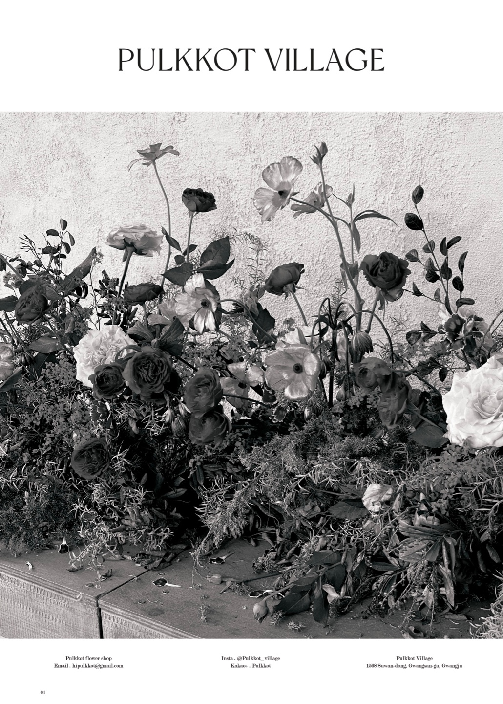
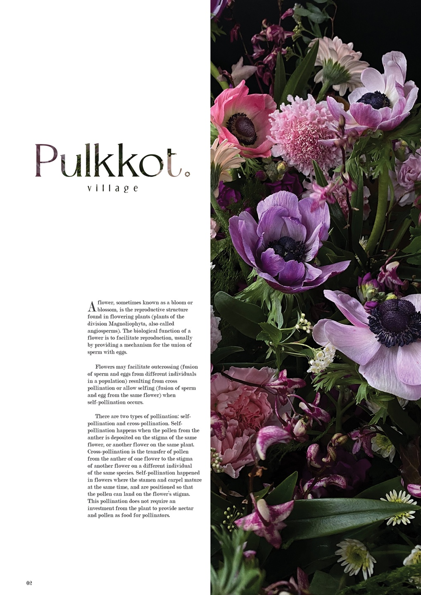

# 🌸Pulkkot Village 풀꽃빌리지_ 플라워샵 웹사이트🌷





## ✔️배포 링크

- 배포 예정 

## ✔️프로젝트 소개

-  플라워샵의 판매 촉진을 위해 웹사이트를 구축하는 프로젝트입니다. 해당 웹사이트에선 플라워샵의 작품 포트폴리오, 상품 정보를 확인할 수 있습니다.

## ✔️기술 스택

 


## ✔️팀원 소개

|  | [](https://github.com/yezyvibe) |
| ------------------------------------------------------------ | ------------------------------------------------------------ |
| **김덕기**                                                   | **조예지**                                                   |
| **BE Developer**                                             | **FE Developer**                                             |


## ✔️기능 목록 명세

* 플라워 클래스 정보 등록 및 읽기
* 상품 컬렉션 정보 등록 및 읽기
* 플라워 공간 장식 포트폴리오 페이지
* 반응형 페이지 구현
* react-responsive-carousel, toast-ui editor 라이브러리 사용


## ✔️프로젝트 설치 및 시작

### 프로젝트 클론

```
$ git clone https://github.com/pulkkot/pulkkot_village.git
```

### FE 패키지 설치

```
$ yarn
```

### FE 서버 실행

```
$ yarn start
```

### BE 패키지 설치

```
$ pip install
```

### BE 서버 실행

```
$ python manage.py runserver
```


